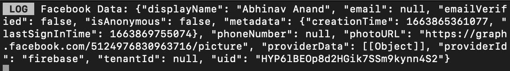

# AuthKit
## This app is based on React Native which uses RN Image Picker, Google SignIn and Facebook Login.

### Screenshot:

### ` Login Screen `

### ` Camera `

### ` Gallery `

### ` Detail Screen `

### ` Terminal - GOOGLE DATA `

### ` Terminal - FACEBOOK DATA `

